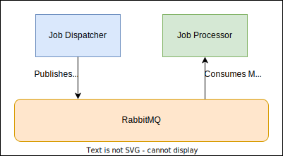

# URL Checker

This is a dummy project that contains two buildable binaries:
- Job Dispatcher: publishes jobs to a message queue
- Job Processor: consumes jobs from a message queue

The primary focus of this project was to play with RabbitMQ and message queues in general.  Eventually I would like both binaries to be horizontally scalable, and the dispatcher can receive batch requests via an endpoint.

### Build
You need to have rabbitmq running locally for this application to work. Then you need to build and run each of the binaries in the /internal/cmd/ folders.
There is a .env file at the root of the project to override environment variables.
**Make**
- There is a premade make file to build the binaries. 
- - `make docker-up` will run a local instance of rabbitmq via docker
- - `make docker-down` will destroy the currently running rabbitmq instance
- - `make build` will output both binaries into ./bin
- - `make run` will build and then run the job distpatcher to load the message queue, followed by the job processor to consume it. Job processor will continue to listen for more events.

## Architecture

Internally, the design is very basic
- There is an abstraction layer ontop of rabbitmq so I can easily swap out implementation
- There is a message queue worker, that listens to a single queue name to consume tasks
- Workers and tasks are written in a way so that it is easy to expand on.